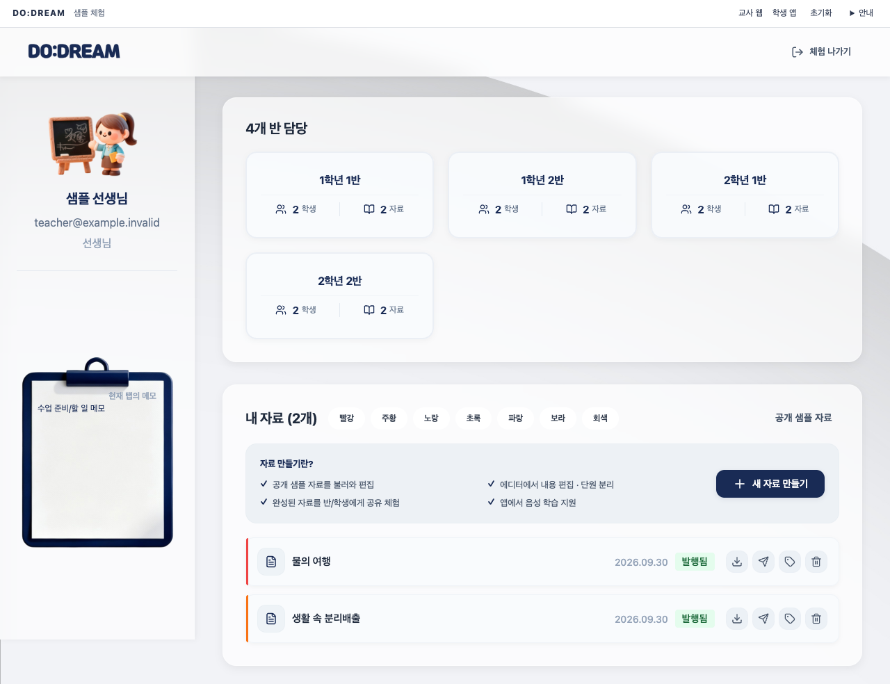
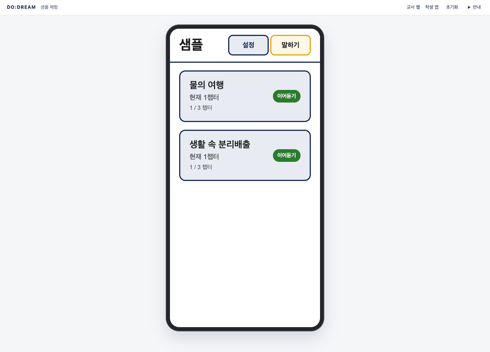

# 📱 DO:DREAM - AI 기반 시각장애인 음성 학습 플랫폼

시각장애 학생이 교재를 읽고 질문하며 퀴즈로 복습할 수 있도록, 교사의 자료 준비와 학생의 학습을 연결한 팀 프로젝트입니다.

**[공개 데모 체험하기](https://rladbstn1000.github.io/DO-DREAM/)** — 원래 교사 웹 디자인과 학생 앱 형태를 옮긴 **정적 샘플**입니다. 준비된 답변·예시 채점을 사용하며 실제 AI·회원가입·문서 변환·서버 저장은 제공하지 않습니다.

**교사 체험**에서 자료·학급·편집기를 둘러보거나, **학생 앱 체험**에서 서재 → 물의 여행 → 재생 방식 → 질문하기 → 서술형 퀴즈 → 결과를 체험하세요. 상단 **교사 웹** → **1학년 1반** → **체험 학생**에서 같은 탭의 질문·풀이를 확인합니다. **말하기**·**음성으로 답하기**는 마이크 대신 예시 선택을 엽니다. [자세한 시연 순서](docs/portfolio/15-demo-walkthrough.md)

## 팀 당시 역할과 이후 개인 개선

| 구분 | 담당 범위 |
|---|---|
| 팀 당시 — 김윤수, 백엔드 | Spring Security·JWT/Redis 인증, LangChain·ChromaDB 질의응답과 이력/reranking 연결, 자료 기반 퀴즈 생성·LLM 서술형 채점, 최신 풀이 기반 통계·오답 조회 |
| 팀 이후 — 개인 개선 | 인증·현재 자료 권한, 제출 결과의 중복 반영 방지와 당시 기준 보존, 실패에 안전한 색인 전환, 학생 웹 흐름·입력/오류 경계·조회 수 개선, 공개용 정적 showcase와 검증 기록 |

원본 교사 웹은 **양세희**, 학생 모바일 앱은 **양진서**의 팀 구현을 바탕으로 복원했습니다. 아래 세 사례는 팀 프로젝트 이후의 개인 개선이며, 전체 팀원과 당시 기여는 [팀 기여 기록](#팀-기여-기록)에 보존했습니다. AI 도구의 활용과 사용자 검토 범위는 [AI 활용](#ai-활용)에 구분합니다.

## 핵심 개선 사례

### 1. 채점 제출의 중복 반영 방지와 당시 기준 보존

**문제:** 재전송·동시 제출이 결과를 중복 반영하고, 교사 편집이 과거 풀이의 의미를 바꿀 수 있었습니다. **결정:** 학생과 제출 키의 DB UNIQUE 제약, 문제·정답·답안 snapshot, 짧은 접수·확정 트랜잭션을 사용했습니다. **결과:** 같은 제출의 결과·로그 중복 반영을 막고 최초 기준으로 결과를 재조회하도록 했으며, 실제 DB의 경쟁·복구 회귀로 확인했습니다. 외부 호출 이후 결과가 불명확하면 `UNKNOWN`으로 남깁니다. 외부 AI의 exactly-once 실행이나 과금 중복 방지는 보장하지 않습니다.

[채점 설계·JDBC 선택](docs/portfolio/09-grading-reliability-design.md) · [동시 제출·복구 검증](docs/portfolio/10-phase3a-results.md) · [저장 코드](be/src/main/java/A704/DODREAM/quiz/grading/GradingStore.java)

### 2. 토큰 종류 검증·회전과 현재 자료 접근권한

**문제:** 서명이 유효한 토큰만으로 토큰의 용도나 현재 자료 접근권한까지 보장할 수 없었습니다. **결정:** Access/Refresh 종류를 구분하고 Redis에서 Refresh Token을 원자적으로 회전하며, Spring과 FastAPI에서 현재 소유·담당·공유 관계를 조회하도록 했습니다. **결과:** 잘못된 토큰 종류·재사용과 권한 회수 후 접근을 거부하는 경로를 검증했습니다. 권한을 오래 캐시하는 방식보다 조회가 늘지만 현재 권한을 반영합니다.

[인증 설계](docs/portfolio/04-auth-security-design.md) · [권한 정책](docs/portfolio/07-authorization-policy.md) · [인증](docs/portfolio/05-phase2a-results.md)/[권한 검증](docs/portfolio/08-phase2b-results.md) · [권한 코드](be/src/main/java/A704/DODREAM/authorization/AuthorizationPolicy.java)

### 3. 후보 인덱스 검증과 활성 버전 전환

**문제:** 새 임베딩 실패가 기존 정상 검색을 훼손하거나, 늦게 끝난 작업이 최신 원본을 덮을 수 있었습니다. **결정:** 원본 revision·실행 generation별 후보 인덱스를 따로 만들고 개수·차원·내용 검증 후 현재 원본 조건에 맞을 때만 활성 포인터를 바꿨습니다. **결과:** 실패한 후보와 기존 활성본을 분리하고 오래된 실행의 전환을 차단하는 장애·복구 경로를 검증했습니다. 후보 저장공간과 상태 관리 부담은 늘어납니다.

[색인 설계](docs/portfolio/11-indexing-reliability-design.md) · [장애·복구 검증](docs/portfolio/12-phase3b-results.md) · [전환 코드](be/src/main/java/A704/DODREAM/indexing/IndexingStore.java)

세 사례의 대안·트레이드오프·코드/테스트 연결은 기존 [18번 코드 리뷰](docs/portfolio/18-portfolio-code-review.md)에 정리했습니다. 위 검증은 실제 백엔드와 격리된 로컬 자원을 사용한 별도 경로이며, 공개 정적 데모가 인증·채점·색인을 실행한다는 뜻이 아닙니다.

## 대표 화면과 아키텍처

현재 공개 체험 화면입니다. 화면별 검증과 제한은 [원본 UI 결과](docs/portfolio/21-original-ui-showcase-results.md)를 확인하세요.

| 교사 자료 목록 | 휴대폰 안의 학생 앱 서재 |
|---|---|
|  |  |

아래는 복원의 기준으로 보존한 **팀 원본 화면**입니다.


| 팀 원본 학생 서재 | 팀 원본 학생 플레이어 |
|---|---|
|  |  |

### 팀 당시 시스템 아키텍처와 기술 스택

아래 두 그림은 **팀 개발 당시 구조**입니다. 이후 추가한 제출 원장·후보 인덱스·정적 showcase의 현재 구조 전체를 나타내지는 않습니다. 현재 차이는 위 설계 문서와 아래 검증 범위를 참고하세요.


## 실행 방법

**서버 없는 showcase:** 저장소 루트에서 실행합니다. Node 22 계열을 사용하고, `verify:showcase`는 설치된 Chrome을 새 독립 context로 실행합니다. Docker·DB·계정·API 키는 필요하지 않습니다.

```sh
cd fe-web
# 의존성이 없는 환경에서만 기존 lock 기준 설치
npm ci --ignore-scripts --no-audit --no-fund
npm run build:showcase
npm run preview:showcase
```

출력된 `http://127.0.0.1:<포트>/DO-DREAM/`를 열고, 종료할 때 해당 터미널에서 Ctrl+C를 누릅니다. 저장소 루트의 별도 터미널에서 `npm --prefix fe-web run verify:showcase`로 타입·빌드 경계·브라우저 인수를 실행할 수 있습니다.

**실제 백엔드 로컬 통합:** [실행 절차](docs/portfolio/02-local-runbook.md)의 격리 환경·추가형 마이그레이션을 먼저 준비한 뒤 `python3 scripts/local/manage.py demo-up`과 `python3 scripts/local/manage.py demo-prepare`를 순서대로 실행합니다. 실제 Spring/FastAPI·MySQL·Redis·Chroma와 명시적 외부 공급자 대역을 사용합니다. 공개 샘플과 별개이며 실제 API 실패를 데모 성공으로 바꾸지 않습니다.

## 검증 범위와 한계

- **백엔드:** 인증·현재 권한·채점 경쟁/복구·색인 전환은 각 결과 문서의 로컬 실행 범위에서 검증했습니다. 과거 실행을 이번 수정의 재실행 결과로 합산하지 않습니다. 원격 CI·공개 인수는 [20번 배포 기록](docs/portfolio/20-publication-and-pages-results.md)과 [21번 원본 UI 결과](docs/portfolio/21-original-ui-showcase-results.md)에 따로 기록합니다.
- **조회 수:** 동일 합성 조건에서 통계 쿼리 **85→9**, AI 이력의 history 부분 **23→3**(권한 포함 전체 **30→10**)을 측정했습니다. 응답속도·처리량 개선율이 아닙니다. [측정 근거](docs/portfolio/18-portfolio-code-review.md)
- **미검증:** 실제 AI 정확도·비용, 실제 음성 청취·모바일 실기기·VoiceOver/WCAG 인증, 전체 백엔드 운영 준비는 검증하지 않았습니다. 브라우저 키보드·접근성 트리 검사를 실제 스크린리더 검증으로 대신하지 않습니다.
- **남은 경계:** localStorage/MMKV의 매체 위험과 운영 HTTPS·기기 보안, 색인의 HA·디스크 손실 복구는 별개입니다. 기존 인덱스의 물리 보존이 현재 열람 허용을 뜻하지 않습니다. 진도는 저장된 학습 위치, 정답률은 채점 결과의 집계이며 실제 이해도 측정값이 아닙니다.
- **공급자와 데이터:** 실제 AI adapter·오프라인 계약·평가셋은 비활성 상태로 보존합니다. 키 존재만으로 실제 공급자를 호출하지 않으며 `REAL_AI_INTEGRATION=NOT_RUN`, `BACKEND_PRODUCTION_READY=false`를 유지합니다. 원시 DB·로그·사용자 이력을 공개 샘플로 내보내지 않습니다.

## AI 활용

개인 개선 과정에서 ChatGPT와 문제·설계 대안·작업 계획을 검토하고, Codex를 구현·테스트 실행·문서 초안에 활용했습니다. 공개 데모 범위와 원본 UI 유지 방향을 정하고, 제안된 변경·실행 보고·화면을 검토하며 진행했습니다.

도구가 실행한 회귀, 직접 확인한 화면, 미검증 범위를 구분해 기록했습니다.

## 상세 문서와 구현 근거

- 개인 개선의 비교 기준은 팀 커밋 `4c763af2316ebb00f523bc43b0c29e49ef7bf62e`입니다. [로드맵](docs/portfolio/01-roadmap.md)과 [최종 코드 리뷰](docs/portfolio/18-portfolio-code-review.md)에 범위·실행 명령·실패와 한계를 구분합니다.
- 실제 학생 웹은 서버 확인 기반 진입, 본문·참고 청크·제출 복구·저장 결과를 기존 웹에 연결했습니다. [학생 웹 검증](docs/portfolio/14-phase4-results.md), 이후 입력·오류·설정·의존성·조회 수와 CI 검토는 [18번](docs/portfolio/18-portfolio-code-review.md)에 있습니다.
- 공개 샘플은 같은 `fe-web`의 명시적인 showcase build mode와 샘플 adapter를 사용합니다. 실제 JWT를 흉내 내지 않고 역할 선택·준비된 답변·예시 채점이 시연임을 표시합니다. [최초 정적 체험](docs/portfolio/19-static-showcase-results.md) · [소스 공개·배포](docs/portfolio/20-publication-and-pages-results.md) · [원본 UI 복원·표시 보완·공개 검증](docs/portfolio/21-original-ui-showcase-results.md)

## 팀 기여 기록

아래 소개·팀원·담당 역할·일정과 협업 기록은 팀 당시 기여를 보존한 것입니다. 이후 개인 개선을 다른 팀원의 원본 구현이나 팀 당시 성과로 소급하지 않습니다.

## 프로젝트 소개

- 시각장애 학생의 학습을 돕기 위해 교사의 자료 편집·공유와 학생의 음성 학습·질문·퀴즈 풀이를 연결한 팀 프로젝트입니다.
- 팀 구현에는 PDF/OCR 처리, LangChain·ChromaDB 기반 자료 검색과 질의응답, LLM 퀴즈 생성·채점, TTS·Firebase 알림, JWT 인증, AWS 파일 저장소가 포함되었습니다. 기능 구현과 효과 검증은 구분합니다. 검색 출처가 있다는 사실만으로 답변의 정확성이 보장되지는 않습니다.
- 교사는 공유 자료·진도·풀이 기록을 조회할 수 있습니다. 진도는 저장된 학습 위치, 정답률은 채점 결과의 집계이며 실제 이해도 측정값이 아닙니다.
- 개인 개선에서는 인증·현재 객체 권한·제출 중복 방지·당시 기준 보존·후보 색인 검증을 강화하고, 기존 웹에 학생 체험 화면을 추가했습니다. 실제 외부 API 품질·비용·운영 배포 검증은 현재 범위에서 제외합니다.

## `DO:DREAM` 팀원 구성

<div align="center">

|                                                                  팀장 / FE                                                                  |                                                            FE                                                             |                                                                BE                                                                |
|:-----------------------------------------------------------------------------------------------------------------------------------------:|:----------------------------------------------------------------------------------------------------------------------------------:|:-----------------------------------------------------------------------------------------------------------------------------------------:|
|    [ <br/> @jinseoy](https://github.com/jinseoy)  | [ <br/> @sehee-xx](https://github.com/sehee-xx) | [ <br/> @rladbstn1000](https://github.com/rladbstn1000) |
|                                                                  **양진서**                                                                  |                                                              **양세희**                                                               |                                                                  **김윤수**                                                                  |
|                                                                  **BE**                                                                   |                                                               **BE**                                                               |                                                                 **Infra**                                                                 |
| [ <br/> @justlikesh](https://github.com/justlikesh) | [ <br/> @Eun31](https://github.com/Eun31)  |   [ <br/> @jgm0327](https://github.com/jgm0327)   |
|                                                                  **김승호**                                                                  |                                                              **이은**                                                               |                                                                  **장규민**                                                                  |

</div>

## 팀 개발 환경과 현재 검증 스택

- Frontend
   - Web: React, Vite, TypeScript
   - App: React Native, TypeScript (네이티브 전체 설치·기기 실행은 이번 검증 제외)
- Backend: Spring Boot 3.5.7, Spring Data JPA, Spring Security, MySQL 8.x, Redis
- 팀 AI 구현: FastAPI, Python, LangChain, ChromaDB, HuggingFace
- 현재 로컬 검증: Java 17·Gradle 8.14.3, Node 22.22.0, Python 3.11, 실제 MySQL 8.4·Redis 7.4·Chroma 0.6.3. 정확한 라이브러리 버전은 `be/build.gradle`, `fe-web/package-lock.json`, 각 Python `requirements.local.lock.txt`를 기준으로 합니다. 외부 모델과 운영 연결은 기본 비활성입니다.
- 버전 및 이슈관리: GitLab, Jira
- 협업 툴: Discord, Notion
- 팀 당시 배포 구성(이번 운영 재검증 제외): AWS EC2, Docker, Nginx, HashiCorp Vault, AWS S3, CloudFront, Jenkins
- 외부 API: Naver Clova OCR, Firebase Cloud Messaging, OpenAI API

## 팀 당시 역할 분담

### 🐯 양진서

#### 담당 역할 : 팀장, 프론트엔드 개발(시각장애 학생용 모바일 앱)

- 학습 자료 관리 시스템
    - 학습 자료 목록 조회 및 상세 정보 표시
    - 섹션별 학습 자료 구조화 및 탐색
    - 학습 진행률 추적 및 표시

- 음성 기반 학습 재생 기능
    - TTS 음성 재생 (섹션별/연속/반복 모드)
    - 재생 속도 조절 및 일시정지/재개
    - 스크린 리더와의 오디오 충돌 방지 처리
    - 음성 명령 기반 재생 컨트롤

- AI 음성 Q&A 시스템
    - 음성 입력 기반 질문 등록
    - AI 답변 TTS 출력
    - 질문 히스토리 조회 및 관리

- 학습 지원 기능
    - 북마크 등록
    - 퀴즈 풀기 및 음성 질문/답변

- 접근성 최적화
    - TalkBack/VoiceOver 대응 구현 (현재 기기별 완전성·접근성 인증은 미검증)
    - 음성 중심 UI/UX 설계
    - 오프라인 학습 지원 (MMKV 로컬 스토리지)

### 👻 김승호

#### 담당 역할 : 백엔드 개발

- PDF 처리 및 OCR 시스템 : PDF 업로드 및 AI 파싱 API  
    - PDF JSON을 TXT로 추출 및 다운로드
    - OCR 기반 문서 구조 감지
    - PDF 파싱 API 통합
- AWS 클라우드 연동 시스템
    - S3 Presigned URL 업로드 기능
    - CloudFront Signed URL 다운로드 기능
    - S3/CloudFront 클라이언트 설정
- Redis 임시 저장 시스템
    - PDF 수정 내용 임시 저장/조회 API
    - Redis 기반 서비스 로직 구현
    - 24시간 자동 삭제
- 개념 Check 추출 시스템
    - JSON 필터링 및 개념 Check 추출
    - FastAPI 연동 및 S3 저장
    - Gemini AI 가공 로직 통합
- 학습 자료 발행 시스템
    - 퀴즈 데이터 JSON 추출 및 S3 저장
    - JSON 콘텐츠 필터링 로직
    - 발행 자료 형식 지원
- 백엔드 인프라 설정
    - 초기 프로젝트 구조 설계
    - 엔티티 설계 및 구현
    - JWT 인증 필터 설정
    - Vault 서버 설정

### 😎 김윤수

#### 담당 역할 : 백엔드 개발

아래는 팀 당시 담당 범위입니다. 뒤의 개인 보안·신뢰성 개선을 팀 당시 성과로 소급하지 않습니다.

- Spring Security·JWT 인증/인가와 Redis Refresh Token 저장·만료·로그아웃 로직 구현
- LangChain·ChromaDB 기반 자료 질의응답, 대화 이력 반영과 reranking 연결 (정확도 개선 수치 미측정)
- 자료 기반 퀴즈 생성과 LLM 서술형 채점 흐름 구현 (의미 유사도 점수 알고리즘 또는 검증된 정밀 채점으로 표현하지 않음)
- 문제별 최신 풀이를 선택하는 학습 통계와 오답 조회 구현 (재풀이 자체를 차단하는 기능과 구분)

### 🐬 양세희

#### 담당 역할 : 프론트엔드 개발 (교사용 웹 개발)

- 학습 자료 관리: 학습 자료 편집 에디터, 자료 발행 및 전송, 워드로 다운로드
- 학생 학습현황 리포트: 학습 진도율, 퀴즈 성적, 질의응답 정보 기록
- 기타 서비스: 자료 컬러 라벨 필터링, 메모장

### 😀 장규민

#### 담당 역할 : 백엔드 & 인프라 개발

- HTTPS 통신 구축 : Nginx를 활용해 SSL 기반 HTTPS 환경 구성
- 블루-그린 배포 : 서비스 무중단 배포 환경 설계 및 운영
- 설정 관리 자동화 : Vault로 민감 정보 및 환경 변수 중앙 관리
- CI/CD 파이프라인 구축 : Jenkins를 활용해 Web, Backend, AI 서비스 자동 빌드·배포
- 학생 상세 정보 조회 : 사용자별 학습 정보 및 프로필 조회 API 개발
- 학습 진행률 관리 : 학습 진도 저장, 조회, 계산 로직 구현 및 데이터 구조 설계

### 😃 이은

#### 담당 역할 : 백엔드 개발

- 자료 발행 시스템
    - 변환 완료된 학습 자료 발행 처리 API 개발
    - 발행 상태 변경 로직 구현
- 발행 자료 조회
    - 교사별 발행 자료 목록 조회 API 개발
    - 발행 이력 및 상태 확인 기능 구현
- 자료 공유 시스템
    - 공유가능한 학생 목록 조회
    - 교사가 학습 자료를 학생에게 공유하는 API 개발
- 푸시 알림 시스템
    - FCM 연동을 통한 자료 공유 시 학생 실시간 알림 기능 구현

## 팀 개발 기간 및 작업 관리

### 개발 기간

- 전체 개발 기간 : 2025-10-02 ~ 2025-11-23
- 기획 및 설계 : 2025-10-02 ~ 2025-10-12
- UI 구현 : 2025-10-12 ~ 2025-10-20
- 기능 구현 : 2025-10-20 ~ 2025-11-20

### 작업 관리

- Jira 이슈 관리 및 대시보드를 활용하여 팀 전체의 작업 진행 상황을 공유했습니다.
- 매일 아침 9시 10분 데일리 스크럼을 진행하여 문제 상황, 진행도, 오늘 할 일 등을 공유하고, Notion 페이지에 스크럼 회의 내용을 기록했습니다.

## 팀 구현의 기술 설명과 현재 차이

- PDF 바이너리는 `application/pdf`로 받습니다. Multipart 제한이 원시 본문까지 제한하지 않는 문제는 개인 리뷰에서 별도 bounded read와 파일 검증으로 수정했습니다.
- CloudFront PEM 처리의 Base64 디코딩은 **암호 해독이 아닌 인코딩 해제**이며, DER 바이트로 RSA PrivateKey를 구성하는 과정입니다. URL 서명은 별도 동작입니다. 실제 AWS 연결은 이번에 실행하지 않았습니다.
- WebClient는 비동기 API를 제공하지만 현재 호출자의 `.block()`은 응답을 동기적으로 기다립니다. timeout이나 DB 트랜잭션만으로 DB·객체 저장소·외부 AI 사이의 원자성이 보장되지 않습니다.
- Redis 임시 편집본의 24시간 TTL은 임시 데이터 만료 정책입니다. JSON 직렬화나 사용자 ID 기반 키 이름 자체가 접근권한 검증을 대신하지 않습니다.
- 팀 당시 임베딩 오류를 로그로만 남기는 경로는 개인 3-B에서 영속 작업 원장·후보 검증·활성 포인터 전환으로 보완했습니다. Redis/Celery 전달과 실제 Chroma 저장을 검증했으며, 외부 모델의 exactly-once는 보장하지 않습니다.
