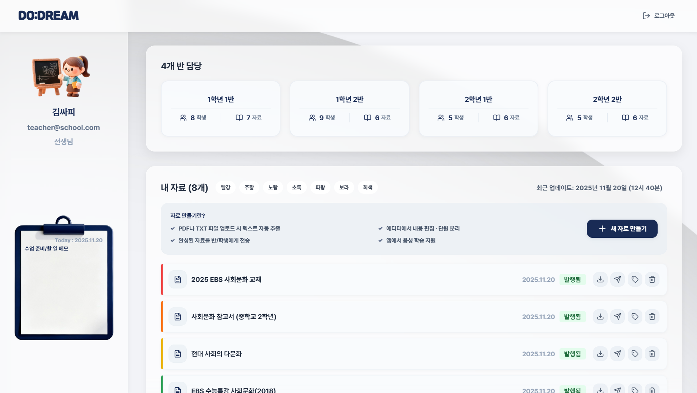
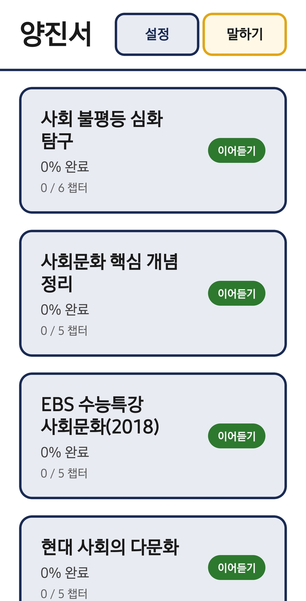
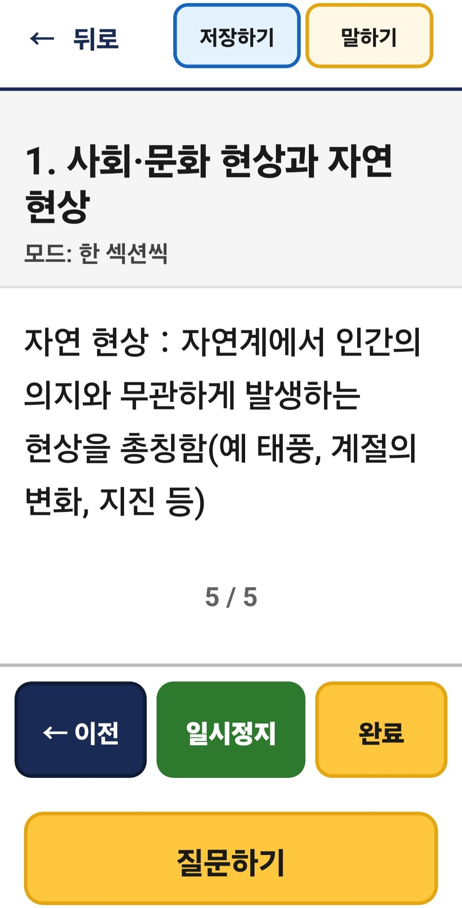
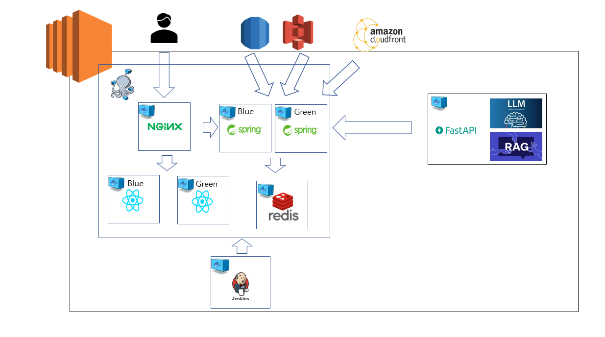
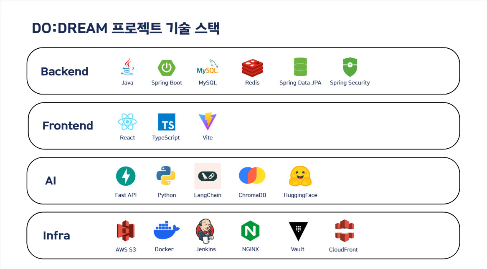

# 📱 DO:DREAM - AI 기반 시각장애인 음성 학습 플랫폼

> 팀 구현 기준은 `4c763af2316ebb00f523bc43b0c29e49ef7bf62e`입니다. 이후 개인 개선은 [로드맵](docs/portfolio/01-roadmap.md)과 [코드 최종 리뷰](docs/portfolio/18-portfolio-code-review.md)에 구분했습니다. 현재 검증 경로는 실제 Spring/FastAPI·MySQL·Redis·Chroma와 명시적인 외부 경계 대역을 쓰는 **키 없는 로컬 통합 모드**입니다. 실제 AI 정확도·모바일 기기·전체 백엔드 운영은 검증하지 않았습니다.
>
> 공개 페이지는 다음 작업에서 샘플 데이터와 브라우저 임시 상태로 화면 흐름을 보여주는 **정적 showcase**로 만들 예정입니다. 아직 구현·배포하지 않았으며, 실제 AI API 키는 그 준비의 필수 조건이 아닙니다. 실제 AI adapter·오프라인 계약 검사·평가셋은 비활성 상태로 보존합니다.
>
> 로컬 체험은 [실행 절차](docs/portfolio/02-local-runbook.md)와 [시연 안내](docs/portfolio/15-demo-walkthrough.md)를 따릅니다. 실행 절차의 첫 기동·V003/V004 마이그레이션을 완료한 뒤 `python3 scripts/local/manage.py demo-up` → `demo-prepare`로 준비하여 [학생 체험](http://127.0.0.1:15173/demo)에 접속합니다. 이는 향후 서버 없는 showcase와 다른 실행 경로입니다.

|
---|---|

## 프로젝트 소개

- 시각장애 학생의 학습을 돕기 위해 교사의 자료 편집·공유와 학생의 음성 학습·질문·퀴즈 풀이를 연결한 팀 프로젝트입니다.
- 팀 구현에는 PDF/OCR 처리, LangChain·ChromaDB 기반 자료 검색과 질의응답, LLM 퀴즈 생성·채점, TTS·Firebase 알림, JWT 인증, AWS 파일 저장소가 포함되었습니다. 기능 구현과 효과 검증은 구분합니다. 검색 출처가 있다는 사실만으로 답변의 정확성이 보장되지는 않습니다.
- 교사는 공유 자료·진도·풀이 기록을 조회할 수 있습니다. 진도는 저장된 학습 위치, 정답률은 채점 결과의 집계이며 실제 이해도 측정값이 아닙니다.
- 개인 개선에서는 인증·현재 객체 권한·제출 중복 방지·당시 기준 보존·후보 색인 검증을 강화하고, 기존 웹에 학생 체험 화면을 추가했습니다. 실제 외부 API 품질·비용·운영 배포 검증은 현재 범위에서 제외합니다.

## `DO:DREAM` 팀원 구성

|                                                                  팀장 / FE                                                                  |                                                            FE                                                             |                                                                BE                                                                |
|:-----------------------------------------------------------------------------------------------------------------------------------------:|:----------------------------------------------------------------------------------------------------------------------------------:|:-----------------------------------------------------------------------------------------------------------------------------------------:|
|    [   @jinseoy](https://github.com/jinseoy)  | [   @sehee-xx](https://github.com/sehee-xx) | [   @rladbstn1000](https://github.com/rladbstn1000) |
|                                                                  **양진서**                                                                  |                                                              **양세희**                                                               |                                                                  **김윤수**                                                                  |
|                                                                  **BE**                                                                   |                                                               **BE**                                                               |                                                                 **Infra**                                                                 |
| [   @justlikesh](https://github.com/justlikesh) | [   @Eun31](https://github.com/Eun31)  |   [   @jgm0327](https://github.com/jgm0327)   |
|                                                                  **김승호**                                                                  |                                                              **이은**                                                               |                                                                  **장규민**                                                                  |

## 1. 팀 개발 환경과 현재 검증 스택

- Frontend
   - Web: React, Vite, TypeScript
   - App: React Native, TypeScript (네이티브 전체 설치·기기 실행은 이번 검증 제외)
- Backend: Spring Boot 3.5.7, Spring Data JPA, Spring Security, MySQL 8.x, Redis
- 팀 AI 구현: FastAPI, Python, LangChain, ChromaDB, HuggingFace
- 현재 로컬 검증: Java 17·Gradle 8.14.3, Node 22.22.0, Python 3.11, 실제 MySQL 8.4·Redis 7.4·Chroma 0.6.3. 정확한 라이브러리 버전은 `be/build.gradle`, `fe-web/package-lock.json`, 각 Python `requirements.local.lock.txt`를 기준으로 합니다. 외부 모델과 운영 연결은 기본 비활성입니다.
- 버전 및 이슈관리: GitLab, Jira
- 협업 툴: Discord, Notion
- 팀 당시 배포 구성(이번 운영 재검증 제외): AWS EC2, Docker, Nginx, HashiCorp Vault, AWS S3, CloudFront, Jenkins
- 외부 API: Naver Clova OCR, Firebase Cloud Messaging, OpenAI API

 

## 2. 시스템 아키텍처 및 사용한 기술 스택

### 시스템 아키텍처

### 기술 스택

 

## 3. 역할 분담

### 🐯 양진서

#### 담당 역할 : 팀장, 프론트엔드 개발(시각장애 학생용 모바일 앱)

- 학습 자료 관리 시스템
    - 학습 자료 목록 조회 및 상세 정보 표시
    - 섹션별 학습 자료 구조화 및 탐색
    - 학습 진행률 추적 및 표시

- 음성 기반 학습 재생 기능
    - TTS 음성 재생 (섹션별/연속/반복 모드)
    - 재생 속도 조절 및 일시정지/재개
    - 스크린 리더와의 오디오 충돌 방지 처리
    - 음성 명령 기반 재생 컨트롤

- AI 음성 Q&A 시스템
    - 음성 입력 기반 질문 등록
    - AI 답변 TTS 출력
    - 질문 히스토리 조회 및 관리

- 학습 지원 기능
    - 북마크 등록
    - 퀴즈 풀기 및 음성 질문/답변

- 접근성 최적화
    - TalkBack/VoiceOver 대응 구현 (현재 기기별 완전성·접근성 인증은 미검증)
    - 음성 중심 UI/UX 설계
    - 오프라인 학습 지원 (MMKV 로컬 스토리지)

### 👻 김승호

#### 담당 역할 : 백엔드 개발

- PDF 처리 및 OCR 시스템 : PDF 업로드 및 AI 파싱 API  
    - PDF JSON을 TXT로 추출 및 다운로드
    - OCR 기반 문서 구조 감지
    - PDF 파싱 API 통합
- AWS 클라우드 연동 시스템
    - S3 Presigned URL 업로드 기능
    - CloudFront Signed URL 다운로드 기능
    - S3/CloudFront 클라이언트 설정
- Redis 임시 저장 시스템
    - PDF 수정 내용 임시 저장/조회 API
    - Redis 기반 서비스 로직 구현
    - 24시간 자동 삭제
- 개념 Check 추출 시스템
    - JSON 필터링 및 개념 Check 추출
    - FastAPI 연동 및 S3 저장
    - Gemini AI 가공 로직 통합
- 학습 자료 발행 시스템
    - 퀴즈 데이터 JSON 추출 및 S3 저장
    - JSON 콘텐츠 필터링 로직
    - 발행 자료 형식 지원
- 백엔드 인프라 설정
    - 초기 프로젝트 구조 설계
    - 엔티티 설계 및 구현
    - JWT 인증 필터 설정
    - Vault 서버 설정

### 😎 김윤수

#### 담당 역할 : 백엔드 개발

아래는 팀 당시 담당 범위입니다. 뒤의 개인 보안·신뢰성 개선을 팀 당시 성과로 소급하지 않습니다.

- Spring Security·JWT 인증/인가와 Redis Refresh Token 저장·만료·로그아웃 로직 구현
- LangChain·ChromaDB 기반 자료 질의응답, 대화 이력 반영과 reranking 연결 (정확도 개선 수치 미측정)
- 자료 기반 퀴즈 생성과 LLM 서술형 채점 흐름 구현 (의미 유사도 점수 알고리즘 또는 검증된 정밀 채점으로 표현하지 않음)
- 문제별 최신 풀이를 선택하는 학습 통계와 오답 조회 구현 (재풀이 자체를 차단하는 기능과 구분)

### 🐬 양세희

#### 담당 역할 : 프론트엔드 개발 (교사용 웹 개발)

- 학습 자료 관리: 학습 자료 편집 에디터, 자료 발행 및 전송, 워드로 다운로드
- 학생 학습현황 리포트: 학습 진도율, 퀴즈 성적, 질의응답 정보 기록
- 기타 서비스: 자료 컬러 라벨 필터링, 메모장

### 😀 장규민

#### 담당 역할 : 백엔드 & 인프라 개발

- HTTPS 통신 구축 : Nginx를 활용해 SSL 기반 HTTPS 환경 구성
- 블루-그린 배포 : 서비스 무중단 배포 환경 설계 및 운영
- 설정 관리 자동화 : Vault로 민감 정보 및 환경 변수 중앙 관리
- CI/CD 파이프라인 구축 : Jenkins를 활용해 Web, Backend, AI 서비스 자동 빌드·배포
- 학생 상세 정보 조회 : 사용자별 학습 정보 및 프로필 조회 API 개발
- 학습 진행률 관리 : 학습 진도 저장, 조회, 계산 로직 구현 및 데이터 구조 설계

### 😃 이은

#### 담당 역할 : 백엔드 개발

- 자료 발행 시스템
    - 변환 완료된 학습 자료 발행 처리 API 개발
    - 발행 상태 변경 로직 구현
- 발행 자료 조회
    - 교사별 발행 자료 목록 조회 API 개발
    - 발행 이력 및 상태 확인 기능 구현
- 자료 공유 시스템
    - 공유가능한 학생 목록 조회
    - 교사가 학습 자료를 학생에게 공유하는 API 개발
- 푸시 알림 시스템
    - FCM 연동을 통한 자료 공유 시 학생 실시간 알림 기능 구현

 

## 4. 개발 기간 및 작업 관리

### 개발 기간

- 전체 개발 기간 : 2025-10-02 ~ 2025-11-23
- 기획 및 설계 : 2025-10-02 ~ 2025-10-12
- UI 구현 : 2025-10-12 ~ 2025-10-20
- 기능 구현 : 2025-10-20 ~ 2025-11-20

### 작업 관리

- Jira 이슈 관리 및 대시보드를 활용하여 팀 전체의 작업 진행 상황을 공유했습니다.
- 매일 아침 9시 10분 데일리 스크럼을 진행하여 문제 상황, 진행도, 오늘 할 일 등을 공유하고, Notion 페이지에 스크럼 회의 내용을 기록했습니다.

 

## 5. 팀 구현의 기술 설명과 현재 차이

- PDF 바이너리는 `application/pdf`로 받습니다. Multipart 제한이 원시 본문까지 제한하지 않는 문제는 개인 리뷰에서 별도 bounded read와 파일 검증으로 수정했습니다.
- CloudFront PEM 처리의 Base64 디코딩은 **암호 해독이 아닌 인코딩 해제**이며, DER 바이트로 RSA PrivateKey를 구성하는 과정입니다. URL 서명은 별도 동작입니다. 실제 AWS 연결은 이번에 실행하지 않았습니다.
- WebClient는 비동기 API를 제공하지만 현재 호출자의 `.block()`은 응답을 동기적으로 기다립니다. timeout이나 DB 트랜잭션만으로 DB·객체 저장소·외부 AI 사이의 원자성이 보장되지 않습니다.
- Redis 임시 편집본의 24시간 TTL은 임시 데이터 만료 정책입니다. JSON 직렬화나 사용자 ID 기반 키 이름 자체가 접근권한 검증을 대신하지 않습니다.
- 팀 당시 임베딩 오류를 로그로만 남기는 경로는 개인 3-B에서 영속 작업 원장·후보 검증·활성 포인터 전환으로 보완했습니다. Redis/Celery 전달과 실제 Chroma 저장을 검증했으며, 외부 모델의 exactly-once는 보장하지 않습니다.

## 6. 팀 프로젝트 이후 개인 개선과 근거

| 사례 | 선택과 검증 근거 | 한계 |
|---|---|---|
| 인증·객체 권한 | AT/RT 종류와 공통 JWT 계약, Redis 원자 회전, 현재 담당·공유 관계를 양 서버에서 확인. [설계04](docs/portfolio/04-auth-security-design.md), [정책07](docs/portfolio/07-authorization-policy.md), [결과05](docs/portfolio/05-phase2a-results.md)·[08](docs/portfolio/08-phase2b-results.md). | 브라우저 localStorage/MMKV 매체 위험과 운영 HTTPS·기기 검증은 별개. |
| 제출 멱등성·당시 기준 | 같은 key·문제 버전·답안과 DB unique, 고정 snapshot, 짧은 접수/확정 트랜잭션. 결과 불명을 0점으로 숨기지 않음. [설계09](docs/portfolio/09-grading-reliability-design.md)·[결과10](docs/portfolio/10-phase3a-results.md). | 외부 호출 중 장애의 UNKNOWN은 중복 실행 가능성을 남김. |
| 후보 검증·활성 전환 | 새 실행을 별도 Chroma 후보에 만들고 개수·차원·내용 검증 후 현재 원본 조건부 전환. [설계11](docs/portfolio/11-indexing-reliability-design.md)·[결과12](docs/portfolio/12-phase3b-results.md). | 구원본 물리 보존이 현재 열람 허용을 뜻하지 않으며 HA/디스크 손실 복구는 미검증. |
| 학생 웹·최종 코드 리뷰 | 서버 확인 기반 진입, 본문·참고 청크·제출 복구·저장 결과를 기존 웹에 연결. [결과14](docs/portfolio/14-phase4-results.md), 입력·오류·설정·의존성·쿼리와 CI는 [최종 리뷰18](docs/portfolio/18-portfolio-code-review.md). | 실제 음성/모바일·외부 모델 품질과 정적 UI 시뮬레이션을 통합 성과로 합산하지 않음. |

각 사례의 문제·원인·대안·트레이드오프·코드/테스트 연결과 재현 명령은 [최종 리뷰](docs/portfolio/18-portfolio-code-review.md)에 제공합니다. 원시 DB·로그·사용자 이력을 공개용 샘플로 내보내지 않습니다.

다음 범위는 같은 `fe-web`의 명시적인 showcase build mode와 샘플 adapter입니다. 실제 JWT를 흉내 내지 않고 역할 선택·준비된 답변·예시 채점이 시연임을 표시합니다. 실제 API 실패를 데모 성공으로 바꾸지 않습니다. 키 없는 CI 작성과 로컬 명령 검증은 원격 GitHub Actions 성공과 다르며, **REMOTE_CI_EXECUTION=NOT_RUN**, **REAL_AI_INTEGRATION=NOT_RUN**입니다.
